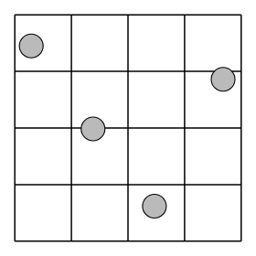
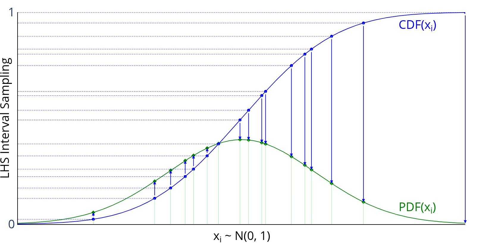

In this section, the following kinds of *randomized designs* will
be described:

- Latin-Hypercube
- Orthogonal Array-based Latin Hypercube
- Sliced Latin Hypercube
- Nested Latin Hypercube
- Maximin Distance Design
- Minimax Distance Design
- Maximum Projection (MaxPro) Design
- Nearly Orthogonal Latin Hypercube
- Random K-Means
- Random Uniform

!!! hint
    All available designs can be accessed after a simple import statement:

    ```pycon
    >>> from pydoe import (
    ...     lhs,
    ...     oa_lhd,
    ...     random_k_means,
    ...     random_uniform,
    ...     sliced_lhs,
    ...     nested_lhs,
    ...     maximin_design,
    ...     minimax_design,
    ...     maxpro_design,
    ...     nearly_orthogonal_lhs,
    ... )
    ```

## Latin-Hypercube (`lhs`) {#latin-hypercube}



Latin-hypercube designs can be created using the following simple syntax:

```python
lhs(n, [samples, criterion, iterations])
```

where

* **n**: an integer that designates the number of factors (required)
* **samples**: an integer that designates the number of sample points to
  generate for each factor (default: n)
* **criterion**: a string that tells `lhs` how to sample the points
  (default: None, which simply randomizes the points within the intervals):

  - "center" or "c": center the points within the sampling intervals
  - "maximin" or "m": maximize the minimum distance between points, but
    place the point in a randomized location within its interval
  - "centermaximin" or "cm": same as "maximin", but centered within the
    intervals
  - "correlation" or "corr": minimize the maximum correlation coefficient
  - "lhsmu" : Latin hypercube with multifimensional Uniformity. Correlation between
     variable can be enforced by setting a valid correlation matrix. Description of the
     algorithm can be found in [*Latin hypercube sampling with multidimensional uniformity*](https://doi.org/10.1016/j.jspi.2011.09.016).

The output design scales all the variable ranges from zero to one which
can then be transformed as the user wishes (like to a specific statistical
distribution using the [`scipy.stats.distributions`](http://docs.scipy.org/doc/scipy/reference/stats.html) `ppf` (inverse
cumulative distribution) function. An example of this is [shown below](#statistical_distribution_usage).

For example, if I wanted to transform the uniform distribution of 8 samples
to a normal distribution (mean=0, standard deviation=1), I would do
something like:

```pycon
>>> from scipy.stats.distributions import norm
>>> lhd = lhs(2, samples=5)
>>> lhd = norm(loc=0, scale=1).ppf(lhd)  # (1)!
```

1. this applies to both factors here

Graphically, each transformation would look like the following, going
from the blue sampled points (from using `lhs`) to the green
sampled points that are normally distributed:



### Examples

A basic 4-factor latin-hypercube design:

```pycon
>>> lhs(4, criterion="center")
array([[ 0.875,  0.625,  0.875,  0.125],
       [ 0.375,  0.125,  0.375,  0.375],
       [ 0.625,  0.375,  0.125,  0.625],
       [ 0.125,  0.875,  0.625,  0.875]])
```

Let's say we want more samples, like 10:

```pycon
>>> lhs(4, samples=10, criterion="center")
array([[ 0.05,  0.05,  0.15,  0.15],
       [ 0.55,  0.85,  0.95,  0.75],
       [ 0.25,  0.25,  0.45,  0.25],
       [ 0.45,  0.35,  0.75,  0.45],
       [ 0.75,  0.55,  0.25,  0.55],
       [ 0.95,  0.45,  0.35,  0.05],
       [ 0.35,  0.95,  0.05,  0.65],
       [ 0.15,  0.65,  0.55,  0.35],
       [ 0.85,  0.75,  0.85,  0.85],
       [ 0.65,  0.15,  0.65,  0.95]])
```

### Customizing with Statistical Distributions {#statistical_distribution_usage}

Now, let's say we want to transform these designs to be normally
distributed with means = `[1, 2, 3, 4]` and standard deviations = `[0.1, 0.5, 1, 0.25]`:

```python
>>> design = lhs(4, samples=10)
>>> from scipy.stats.distributions import norm
>>> means = [1, 2, 3, 4]
>>> stdvs = [0.1, 0.5, 1, 0.25]
>>> for i in xrange(4):
...     design[:, i] = norm(loc=means[i], scale=stdvs[i]).ppf(design[:, i])
...
>>> design
array([[ 0.84947986,  2.16716215,  2.81669487,  3.96369414],
       [ 1.15820413,  1.62692745,  2.28145071,  4.25062028],
       [ 0.99159933,  2.6444164 ,  2.14908071,  3.45706066],
       [ 1.02627463,  1.8568382 ,  3.8172492 ,  4.16756309],
       [ 1.07459909,  2.30561153,  4.09567327,  4.3881782 ],
       [ 0.896079  ,  2.0233295 ,  1.54235909,  3.81888286],
       [ 1.00415   ,  2.4246118 ,  3.3500082 ,  4.07788558],
       [ 0.91999246,  1.50179698,  2.70669743,  3.7826346 ],
       [ 0.97030478,  1.99322045,  3.178122  ,  4.04955409],
       [ 1.12124679,  1.22454846,  4.52414072,  3.8707982 ]])
```

!!! note
    Methods for "space-filling" designs and "orthogonal" designs are in the works, so stay tuned! However, simply increasing the samples reduces the need for these anyway.

## Orthogonal Array-based Latin Hypercube (`oa_lhd`) {#orthogonal-array-based-latin-hypercube}

`oa_lhd` builds a Latin hypercube design from a symmetric orthogonal
array using Tang's (1993) construction. Each column of the result is a
permutation of all `N` cell midpoints, jittered within the cell, while
respecting the level structure of the orthogonal array. This gives
better two-dimensional uniformity than a plain random Latin hypercube.

```pycon
>>> oa_lhd(oa, [seed])
```

where

* **oa**: a 2D array-like `OA(N, k, s, 2)` with integer levels
  `0, ..., s - 1`, each level appearing exactly `N / s` times in every
  column (e.g. from [`get_orthogonal_array`](taguchi.md))
* **seed**: an integer or `np.random.Generator` for reproducibility
  (default: `None`)

The output design scales to the unit hypercube $[0, 1)^k$ with `N`
cells.

### Examples

```pycon
>>> from pydoe import get_orthogonal_array, oa_lhd
>>> oa = get_orthogonal_array("L9(3^4)")
>>> oa_lhd(oa, seed=0)
array([[0.31813099, 0.17127347, 0.03330132, 0.26918747],
       [0.00314663, 0.34714259, 0.63006938, 0.40524328],
       [0.17948723, 0.70929751, 0.88857888, 0.77564837],
       [0.63172689, 0.29449548, 0.52093853, 0.82099127],
       [0.45945517, 0.63572093, 0.94726159, 0.14558243],
       [0.38731504, 0.98772087, 0.32600484, 0.59531058],
       [0.9523922 , 0.03576327, 0.7327    , 0.48199014],
       [0.71017989, 0.54336382, 0.13635084, 0.9581319 ],
       [0.78711282, 0.87029379, 0.4207887 , 0.0265966 ]])
```

## Sliced Latin Hypercube (`sliced_lhs`) {#sliced-latin-hypercube}

`sliced_lhs` partitions an $N = mt$-point Latin hypercube design into
`t` slices of `m` points each, such that the full design is a Latin
hypercube over `N` cells *and* every individual slice, once rescaled
to its own unit hypercube, is itself a Latin hypercube over `m` cells.
This is useful for computer experiments that mix qualitative levels
(one per slice) with quantitative factors.

```pycon
>>> sliced_lhs(n_factors, m, t, [seed])
```

where

* **n_factors**: an integer that designates the number of factors
  (required, must be at least 1)
* **m**: an integer that designates the number of points per slice
  (required, must be at least 1)
* **t**: an integer that designates the number of slices (required,
  must be at least 1)
* **seed**: an integer or `np.random.Generator` for reproducibility
  (default: `None`)

`sliced_lhs` returns a tuple `(design, slices)` where `design` is an
`(m * t, n_factors)` array in $[0, 1)^\text{n\_factors}$ and `slices`
is a length-`m * t` array of slice labels `0, ..., t - 1`.

### Examples

```pycon
>>> from pydoe import sliced_lhs
>>> design, slices = sliced_lhs(2, 3, 2, seed=0)
>>> design
array([[0.4344393 , 0.45491609],
       [0.09060417, 0.1558454 ],
       [0.30264226, 0.16712308],
       [0.97623405, 0.67226426],
       [0.78827591, 0.86260927],
       [0.64386315, 0.59024354]])
>>> slices
array([0, 0, 0, 1, 1, 1])
```

## Nested Latin Hypercube (`nested_lhs`) {#nested-latin-hypercube}

`nested_lhs` constructs two Latin hypercube designs, a "small" design
with $n_1$ points and a "large" design with $n_2 = n_1 k$ points, such
that the small design is nested within the large one: every cell of the
small design corresponds to a contiguous block of $k$ cells in the large
design. This is useful for multi-fidelity computer experiments, where the
small design is run on an expensive high-fidelity simulator and the large
design on a cheaper low-fidelity simulator.

```pycon
>>> nested_lhs(n_factors, n1, k, [seed])
```

where

* **n_factors**: an integer that designates the number of factors
  (required, must be at least 1)
* **n1**: an integer that designates the number of points in the small
  design (required, must be at least 1)
* **k**: an integer that designates the ratio of large to small design
  size (required, must be at least 1)
* **seed**: an integer or `np.random.Generator` for reproducibility
  (default: `None`)

`nested_lhs` returns a tuple `(small_design, large_design)` where
`small_design` has shape `(n1, n_factors)` and `large_design` has shape
`(n1 * k, n_factors)`, both in $[0, 1)^\text{n\_factors}$.

### Examples

```pycon
>>> from pydoe import nested_lhs
>>> small, large = nested_lhs(2, 3, 2, seed=0)
>>> small
array([[0.86887859, 0.24316552],
       [0.18120833, 0.64502414],
       [0.60528452, 0.6675795 ]])
>>> large
array([[0.97623405, 0.17226426],
       [0.78827591, 0.02927594],
       [0.14386315, 0.59024354],
       [0.21661865, 0.4037812 ],
       [0.33805328, 0.68738055],
       [0.61177074, 0.94119825]])
```

## Maximin Distance Design (`maximin_design`) {#maximin-design}

`maximin_design` constructs a Latin hypercube design optimized via
coordinate-exchange local search to maximize the minimum pairwise
Euclidean distance between design points. Maximin designs spread points
as far apart as possible, which is desirable for space-filling computer
experiments.

```pycon
>>> maximin_design(n_points, n_factors, *, iterations=200, seed=None)
```

where

* **n_points**: an integer that designates the number of points
  (required, must be at least 2)
* **n_factors**: an integer that designates the number of factors
  (required, must be at least 1)
* **iterations**: an integer giving the number of local-search swaps to
  attempt (default: 200, must be at least 0)
* **seed**: an integer or `np.random.Generator` for reproducibility
  (default: `None`)

### Examples

```pycon
>>> from pydoe import maximin_design
>>> maximin_design(5, 2, iterations=50, seed=0)
array([[0.5, 0.9],
       [0.9, 0.3],
       [0.7, 0.5],
       [0.1, 0.1],
       [0.3, 0.7]])
```

## Minimax Distance Design (`minimax_design`) {#minimax-design}

`minimax_design` selects `n_points` points from a large random candidate
set so as to minimize the maximum distance from any point in the
candidate set to its nearest selected design point (a k-center / facility
location criterion), refined via swap-based local search.

```pycon
>>> minimax_design(n_points, n_factors, *, n_candidates=1000,
...                iterations=200, seed=None)
```

where

* **n_points**: an integer that designates the number of points to
  select (required, must be at least 1)
* **n_factors**: an integer that designates the number of factors
  (required, must be at least 1)
* **n_candidates**: an integer that designates the size of the random
  candidate pool (default: 1000, must be at least `n_points`)
* **iterations**: an integer giving the number of local-search swaps to
  attempt (default: 200, must be at least 0)
* **seed**: an integer or `np.random.Generator` for reproducibility
  (default: `None`)

### Examples

```pycon
>>> from pydoe import minimax_design
>>> minimax_design(4, 2, n_candidates=200, iterations=50, seed=0)
array([[0.23231148, 0.74875573],
       [0.81812097, 0.62650646],
       [0.33611706, 0.15027947],
       [0.94367777, 0.19929834]])
```

## Maximum Projection Design (`maxpro_design`) {#maxpro-design}

`maxpro_design` constructs a Latin hypercube design optimized via
coordinate-exchange local search to minimize the MaxPro criterion
$\psi = \sum_{i<j} \prod_{k=1}^{p} (x_{ik} - x_{jk})^{-2}$, which
guarantees good space-filling properties in every projection onto a
subset of factors.

```pycon
>>> maxpro_design(n_points, n_factors, *, iterations=200, seed=None)
```

where

* **n_points**: an integer that designates the number of points
  (required, must be at least 2)
* **n_factors**: an integer that designates the number of factors
  (required, must be at least 1)
* **iterations**: an integer giving the number of local-search swaps to
  attempt (default: 200, must be at least 0)
* **seed**: an integer or `np.random.Generator` for reproducibility
  (default: `None`)

### Examples

```pycon
>>> from pydoe import maxpro_design
>>> maxpro_design(5, 2, iterations=50, seed=0)
array([[0.3, 0.9],
       [0.9, 0.3],
       [0.7, 0.7],
       [0.5, 0.1],
       [0.1, 0.5]])
```

## Nearly Orthogonal Latin Hypercube (`nearly_orthogonal_lhs`) {#nearly-orthogonal-lhs}

`nearly_orthogonal_lhs` constructs a Latin hypercube design optimized via
coordinate-exchange local search to minimize the maximum absolute pairwise
Pearson correlation between columns. This reduces confounding between
factor effect estimates compared to a plain random Latin hypercube.

```pycon
>>> nearly_orthogonal_lhs(n_points, n_factors, *, iterations=200, seed=None)
```

where

* **n_points**: an integer that designates the number of points
  (required, must be at least 2)
* **n_factors**: an integer that designates the number of factors
  (required, must be at least 1)
* **iterations**: an integer giving the number of local-search swaps to
  attempt (default: 200, must be at least 0)
* **seed**: an integer or `np.random.Generator` for reproducibility
  (default: `None`)

### Examples

```pycon
>>> from pydoe import nearly_orthogonal_lhs
>>> nearly_orthogonal_lhs(8, 3, iterations=100, seed=0)
array([[0.8125, 0.5625, 0.4375],
       [0.5625, 0.3125, 0.5625],
       [0.4375, 0.1875, 0.1875],
       [0.3125, 0.6875, 0.9375],
       [0.6875, 0.8125, 0.8125],
       [0.0625, 0.9375, 0.0625],
       [0.1875, 0.0625, 0.6875],
       [0.9375, 0.4375, 0.3125]])
```

!!! note
    This is an optimization-based construction that directly minimizes
    pairwise column correlation, rather than the tabulated designs of
    Cioppa, T. M., & Lucas, T. W. (2007). "Efficient nearly orthogonal
    and space-filling Latin hypercubes." *Technometrics*, 49(1), 45-55.

## Random K-Means (`random_k_means`) {#random-k-means}

Random K-Means generates cluster centers using MacQueen's K-Means algorithm.
This method creates well-distributed points in the unit hypercube by iteratively
updating cluster centers based on randomly sampled points.

Random K-Means designs can be created using the following syntax:

```pycon
>>> random_k_means(num_points,
                   dimension,
                   [num_steps, initial_points, callback, seed])
```

where

* `num_points`: an integer that designates the number of cluster centers to generate (required)
* `dimension`: an integer that designates the dimensionality of the space (required)
* `num_steps`: an integer that designates the number of iterations (default: 100 * num_points)
* `initial_points`: an array of initial cluster centers (default: None, which uses random points)
* `callback`: a callable function called at each step with current cluster centers (default: None)
* `seed`: an integer or `np.random.Generator` for reproducibility (default: None)
* `random_state`: (Deprecated) Use `seed` parameter instead


The output design contains cluster centers that are well-distributed across the
unit hypercube $[0, 1]^\text{dimension}$.

### Examples

A basic 3-point, 2-dimensional Random K-Means design:

```python
>>> random_k_means(3, 2, random_state=42)
array([[0.50047407, 0.49860013],
       [0.50168345, 0.50033893],
       [0.49956536, 0.50004765]])
```

With custom initial points:

```python
>>> initial = [[0.1, 0.1], [0.5, 0.5], [0.9, 0.9]]
>>> random_k_means(3, 2, initial_points=initial, num_steps=50, random_state=42)
array([[0.24854237, 0.25041155],
       [0.50043582, 0.50058412],
       [0.75123745, 0.74896743]])
```

## Random Uniform (`random_uniform`) {#random-uniform}

Random Uniform generates random samples from a uniform distribution over the
half-open interval [0, 1). This is a simple wrapper around `numpy.random.rand`
that provides a consistent interface with other PyDOE functions.

Random Uniform designs can be created using the following syntax:

```python
>>> random_uniform(num_points, dimension)
```

where

* **num_points**: an integer that designates the number of random points to generate (required)
* **dimension**: an integer that designates the dimensionality of each point (required)

The output design contains completely random points uniformly distributed in
the unit hypercube $[0, 1)^\text{dimension}$.

### Examples

A basic 5-point, 3-dimensional Random Uniform design:

```python
>>> np.random.seed(42)  # For reproducibility
>>> random_uniform(5, 3)
array([[0.37454012, 0.95071431, 0.73199394],
       [0.59865848, 0.15601864, 0.15599452],
       [0.05808361, 0.86617615, 0.60111501],
       [0.70807258, 0.02058449, 0.96990985],
       [0.83244264, 0.21233911, 0.18182497]])
```

For 2D visualization:

```pycon
>>> np.random.seed(123)
>>> points = random_uniform(20, 2)  # (1)!
```

1.  Points are completely random with no structure

## References

- Qian, P. Z. G. (2009). "Nested Latin hypercube designs." *Biometrika*, 96(4), 957-970.
- Johnson, M. E., Moore, L. M., & Ylvisaker, D. (1990). "Minimax and maximin distance designs." *Journal of Statistical Planning and Inference*, 26(2), 131-148.
- Joseph, V. R., Gul, E., & Ba, S. (2015). "Maximum projection designs for computer experiments." *Biometrika*, 102(2), 371-380.
- Cioppa, T. M., & Lucas, T. W. (2007). "Efficient nearly orthogonal and space-filling Latin hypercubes." *Technometrics*, 49(1), 45-55.

## More Information

If the user needs more information about appropriate designs, please
consult the following articles on Wikipedia:

- [Latin-Hypercube designs](http://en.wikipedia.org/wiki/Latin_hypercube_sampling)

There is also a wealth of information on the [NIST](http://www.itl.nist.gov/div898/handbook/pri/pri.htm) website about the
various design matrices that can be created as well as detailed information
about designing/setting-up/running experiments in general.