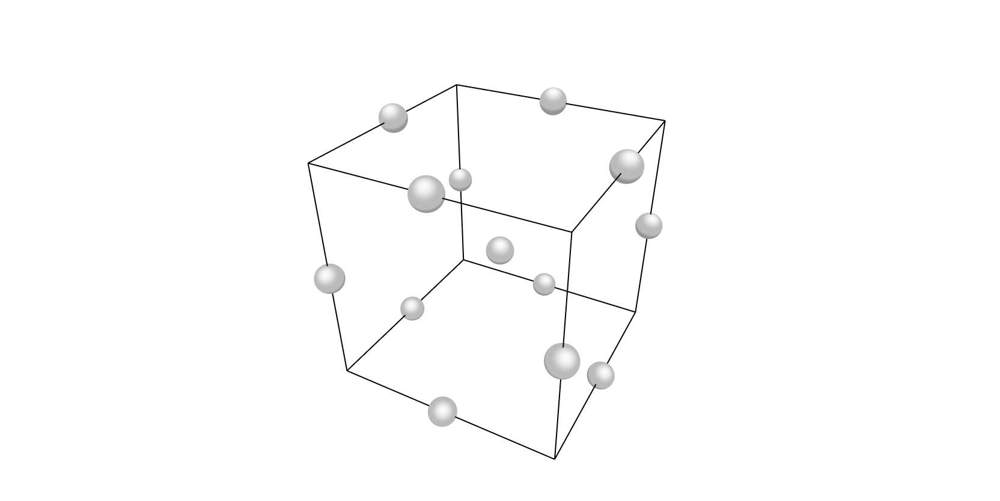

In this section, the following kinds of *response surface designs* will 
be described:

- [Box-Behnken](#box_behnken)
- [Central Composite](#central_composite)
- [Doehlert Design](#doehlert_design)
- [Blocked Central Composite Design](#blocked-central-composite-design-block_ccdesign)
- [Small Composite Design (Hartley)](#small-composite-design-hartley-small_composite_design)

!!! hint
    All available designs can be accessed after a simple import statement:
    ```pycon
    >>> from pydoe import (
    ...     bbdesign,
    ...     ccdesign,
    ...     doehlert_shell_design,
    ...     doehlert_simplex_design,
    ...     block_ccdesign,
    ...     small_composite_design,
    ... )
    ```

## Box-Behnken (`bbdesign`) {#box_behnken}



Box-Behnken designs can be created using the following simple syntax:

```python
bbdesign(n, center)
```

where `n` is the number of factors (at least 3 required) and `center`
is the number of center points to include. If no inputs given to
`center`, then a pre-determined number of points are automatically
included.

### Examples

The default 3-factor Box-Behnken design:

```pycon
>>> bbdesign(3)
array([[-1., -1.,  0.],
       [ 1., -1.,  0.],
       [-1.,  1.,  0.],
       [ 1.,  1.,  0.],
       [-1.,  0., -1.],
       [ 1.,  0., -1.],
       [-1.,  0.,  1.],
       [ 1.,  0.,  1.],
       [ 0., -1., -1.],
       [ 0.,  1., -1.],
       [ 0., -1.,  1.],
       [ 0.,  1.,  1.],
       [ 0.,  0.,  0.],
       [ 0.,  0.,  0.],
       [ 0.,  0.,  0.]])
```

A customized design with four factors, but only a single center point:

```pycon
>>> bbdesign(4, center=1)
array([[-1., -1.,  0.,  0.],
       [ 1., -1.,  0.,  0.],
       [-1.,  1.,  0.,  0.],
       [ 1.,  1.,  0.,  0.],
       [-1.,  0., -1.,  0.],
       [ 1.,  0., -1.,  0.],
       [-1.,  0.,  1.,  0.],
       [ 1.,  0.,  1.,  0.],
       [-1.,  0.,  0., -1.],
       [ 1.,  0.,  0., -1.],
       [-1.,  0.,  0.,  1.],
       [ 1.,  0.,  0.,  1.],
       [ 0., -1., -1.,  0.],
       [ 0.,  1., -1.,  0.],
       [ 0., -1.,  1.,  0.],
       [ 0.,  1.,  1.,  0.],
       [ 0., -1.,  0., -1.],
       [ 0.,  1.,  0., -1.],
       [ 0., -1.,  0.,  1.],
       [ 0.,  1.,  0.,  1.],
       [ 0.,  0., -1., -1.],
       [ 0.,  0.,  1., -1.],
       [ 0.,  0., -1.,  1.],
       [ 0.,  0.,  1.,  1.],
       [ 0.,  0.,  0.,  0.]])
```

## Central Composite (`ccdesign`) {#central_composite}


Central composite designs can be created and customized using the syntax:

```python
ccdesign(n, center, alpha, face)
```

where

- `n` is the number of factors,
- `center` is a 2-tuple of center points (one for the factorial block, one for the star block, default (4, 4))
- `alpha` is either "orthogonal" (or "o", default) or "rotatable" (or "r")
- `face` is either "circumscribed" (or "ccc", default), "inscribed" (or "cci"), or "faced" (or "ccf").


The two optional keyword arguments `alpha` and `face` help describe
how the variance in the quadratic approximation is distributed. Please
see the [NIST](http://www.itl.nist.gov/div898/handbook/pri/pri.htm) web pages
if you are uncertain which options are suitable for your situation.

!!! note
    - 'ccc' and 'cci' can be rotatable designs, but 'ccf' cannot.
    - If `face` is specified, while `alpha` is not, then the default value of `alpha` is 'orthogonal'.

### Examples

Simplest input, assuming default kwargs:

```pycon
>>> ccdesign(2)
array([[-1.        , -1.        ],
       [ 1.        , -1.        ],
       [-1.        ,  1.        ],
       [ 1.        ,  1.        ],
       [ 0.        ,  0.        ],
       [ 0.        ,  0.        ],
       [ 0.        ,  0.        ],
       [ 0.        ,  0.        ],
       [-1.41421356,  0.        ],
       [ 1.41421356,  0.        ],
       [ 0.        , -1.41421356],
       [ 0.        ,  1.41421356],
       [ 0.        ,  0.        ],
       [ 0.        ,  0.        ],
       [ 0.        ,  0.        ],
       [ 0.        ,  0.        ]])
```

More customized input, say, for a set of computer experiments where there
isn't variability so we only need a single center point:

```pycon
>>> ccdesign(3, center=(0, 1), alpha="r", face="cci")
array([[-0.59460356, -0.59460356, -0.59460356],
       [ 0.59460356, -0.59460356, -0.59460356],
       [-0.59460356,  0.59460356, -0.59460356],
       [ 0.59460356,  0.59460356, -0.59460356],
       [-0.59460356, -0.59460356,  0.59460356],
       [ 0.59460356, -0.59460356,  0.59460356],
       [-0.59460356,  0.59460356,  0.59460356],
       [ 0.59460356,  0.59460356,  0.59460356],
       [-1.        ,  0.        ,  0.        ],
       [ 1.        ,  0.        ,  0.        ],
       [ 0.        , -1.        ,  0.        ],
       [ 0.        ,  1.        ,  0.        ],
       [ 0.        ,  0.        , -1.        ],
       [ 0.        ,  0.        ,  1.        ],
       [ 0.        ,  0.        ,  0.        ]])
```

## Doehlert Design (`doehlert_shell_design`, `doehlert_simplex_design`) {#doehlert_design}

An alternative and very useful design for second-order models is the **uniform shell design** proposed by Doehlert in 1970 [1](https://doi.org/10.2307/2346327).  
Doehlert designs are especially advantageous when optimizing multiple variables, requiring fewer experiments than central composite designs, while providing efficient and uniform coverage of the experimental domain.

The Doehlert design defines a **spherical experimental domain** and emphasizes **uniform space filling**. Although it is not orthogonal or rotatable, it is generally sufficient for practical applications.

For two variables, the Doehlert design consists of a center point and six points forming a regular hexagon, situated on a circle. The total number of experiments is given by: $$ N = k^2 + k + C_0 $$
where

- $k$ = number of factors (variables)
- $C_0$ = number of center points

Two implementations are included:

- `doehlert_shell_design`: uses a shell-based spherical approach with optional center points.
- `doehlert_simplex_design`: uses a simplex-based method to uniformly fill the design space.

### Examples

Create a Doehlert design with 3 factors and 1 center point using the shell approach:

```pycon
>>> doehlert_shell_design(3, num_center_points=1)
array([[ 0.       ,  0.       ,  0.        ],
       [ 1.       ,  0.       ,  0.        ],
       [-0.5      ,  0.8660254,  0.        ],
       [-0.5      , -0.8660254,  0.        ],
       [ 0.8660254,  0.5      ,  0.        ],
       [ 0.8660254, -0.5      ,  0.        ],
       ...                                  ])
```

Create a Doehlert design using the simplex approach for 3 factors:

```pycon
>>> doehlert_simplex_design(3)
array([[ 0.      ,  0.       , 0.        ],
       [ 1.      ,  0.       , 0.        ],
       [ 0.      ,  0.8660254, 0.        ],
       [ 0.      ,  0.5      , 0.81649658],
       [-1.      ,  0.       , 0.        ],
       [ 0.      , -0.8660254, 0.        ],
       ...                                ])
```

!!! note
    Doehlert designs are recommended for response surface modeling when good space coverage and fewer experimental runs are desired.


## Blocked Central Composite Design (`block_ccdesign`) {#blocked-central-composite-design-block_ccdesign}

When the factorial portion and the axial portion of a central composite
design must be run in separate blocks, `block_ccdesign` chooses the
axial distance `alpha` orthogonally so the block effect does not bias
the estimated factor effects, and returns a block label for each run.

```pycon
>>> design, blocks = block_ccdesign(n, center=(4, 4))  # (1)!
```

1. `n` — number of factors (≥ 2). `center` — number of center runs added
   to the factorial block and the axial block, respectively.

```pycon
>>> design, blocks = block_ccdesign(2, center=(2, 2))
>>> blocks
array([0, 0, 0, 0, 0, 0, 1, 1, 1, 1, 1, 1])
```

!!! note
    Block 0 is the $2^n$ factorial points plus `center[0]` center runs;
    block 1 is the $2n$ axial points plus `center[1]` center runs.

## Small Composite Design (Hartley) (`small_composite_design`) {#small-composite-design-hartley-small_composite_design}

Hartley's small composite design augments a resolution-III fractional
factorial (instead of a full $2^n$ factorial) with star points and
center runs, fitting a full quadratic model with substantially fewer
runs — particularly useful for 4-5 factors.

```pycon
>>> small_composite_design(n, center=(4, 4))  # (1)!
```

1. `n` — number of factors (≥ 3). `center` — number of center runs
   added to the cube portion and the star portion, respectively.

For 4 factors this needs only 20 runs versus 30 for a standard CCD
built on the full $2^4$ factorial:

```pycon
>>> small_composite_design(4, center=(2, 2)).shape[0]
20
```

!!! note
    Reference: Hartley, H. O. (1959). Smallest composite designs for
    quadratic response surfaces. *Technometrics*, 1(4), 56-63.

## More Information

If the user needs more information about appropriate designs, please 
consult the following articles:

- [Box-Behnken designs](http://en.wikipedia.org/wiki/Box-Behnken_design)
- [Central composite designs](http://en.wikipedia.org/wiki/Central_composite_design)
- [Doehlert design](https://academic.oup.com/jrsssc/article/19/3/231/6882590)

There is also a wealth of information on the [NIST](http://www.itl.nist.gov/div898/handbook/pri/pri.htm) website about the
various design matrices that can be created as well as detailed information
about designing/setting-up/running experiments in general.
